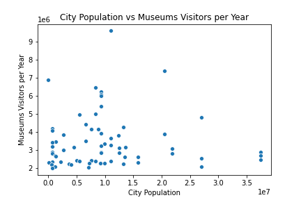
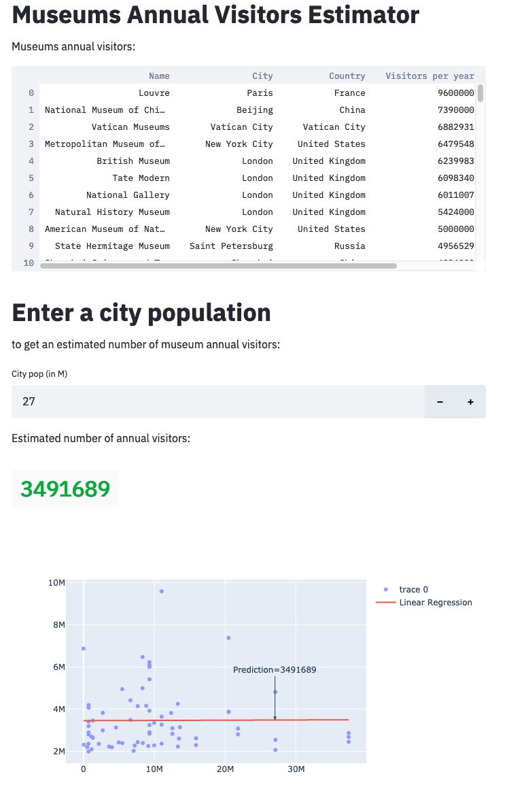

# Museums demo

Small demo of [Streamlit](https://www.streamlit.io/). 

Using [wikipedia](https://en.wikipedia.org/wiki/List_of_most-visited_museums) data on museums annual attendance,
it performs a simple linear regression to predict museums annual visitors from the city's population.


## Method

The (naive 😉) model performs a simple linear interpolation to try and predict a museum's annual attendance from
the city's population. 

Note that it is unrealistic to use a simple linear regression in this context. 
We can see that there is no clear correlation between a city's population and a museum attendance:



For example, the Vatican Museums attract 6.8M visitors/year, but has only a population of 618, while
the Guangdong Museum attracts 2.2M visitors/year and has a population 13M...

Many factors, contextual and seasonal may affect the museums attendance.
 
(See the table below)


## Code organization

The [streamlit](https://www.streamlit.io/) dashboard code can be found in ./museums/dashboard.py 

You can find exploratory jupyter notebooks in the ./museums/ folder


# How to run the dashboard

Here is a screenshot of the dashboard: 

To run your own copy, see instructions below.


> 


## Running the prebuilt docker container

``` 
docker run -p 8080:8080 yanickc/museums-demo
```

and then open a browser at ttp://localhost:8080


## Building the docker image


Clone this repository and then:
```
make build
```

Launch the local docker container:
```
make run
```     

Then, open http://localhost:8080 in a browser.


## Local python

Prerequisites:
- Python 3
- [poetry](https://python-poetry.org/)

Install dependencies:
``` 
poetry install
```           

Start the dashboard:
```               
poetry run streamlit run ./museums/dashboard.py
```

Open http://localhost:8501 in a browser.

 
 
# Appendix

## Museums table with appended cities population

<div>
    <table border="1" class="dataframe">
      <thead>
        <tr style="text-align: right;">
          <th></th>
          <th>Name</th>
          <th>City</th>
          <th>Country</th>
          <th>Visitors per year</th>
          <th>Population</th>
        </tr>
      </thead>
      <tbody>
        <tr>
          <th>0</th>
          <td>Louvre</td>
          <td>Paris</td>
          <td>France</td>
          <td>9600000</td>
          <td>11017230</td>
        </tr>
        <tr>
          <th>1</th>
          <td>National Museum of China</td>
          <td>Beijing</td>
          <td>China</td>
          <td>7390000</td>
          <td>20462610</td>
        </tr>
        <tr>
          <th>2</th>
          <td>Vatican Museums</td>
          <td>Vatican City</td>
          <td>Vatican City</td>
          <td>6882931</td>
          <td>618</td>
        </tr>
        <tr>
          <th>3</th>
          <td>Metropolitan Museum of Art[c]</td>
          <td>New York City</td>
          <td>United States</td>
          <td>6479548</td>
          <td>8323340</td>
        </tr>
        <tr>
          <th>4</th>
          <td>British Museum</td>
          <td>London</td>
          <td>United Kingdom</td>
          <td>6239983</td>
          <td>9304016</td>
        </tr>
        <tr>
          <th>5</th>
          <td>Tate Modern</td>
          <td>London</td>
          <td>United Kingdom</td>
          <td>6098340</td>
          <td>9304016</td>
        </tr>
        <tr>
          <th>6</th>
          <td>National Gallery</td>
          <td>London</td>
          <td>United Kingdom</td>
          <td>6011007</td>
          <td>9304016</td>
        </tr>
        <tr>
          <th>7</th>
          <td>Natural History Museum</td>
          <td>London</td>
          <td>United Kingdom</td>
          <td>5424000</td>
          <td>9304016</td>
        </tr>
        <tr>
          <th>8</th>
          <td>American Museum of Natural History</td>
          <td>New York City</td>
          <td>United States</td>
          <td>5000000</td>
          <td>8323340</td>
        </tr>
        <tr>
          <th>9</th>
          <td>State Hermitage Museum</td>
          <td>Saint Petersburg</td>
          <td>Russia</td>
          <td>4956529</td>
          <td>5467808</td>
        </tr>
        <tr>
          <th>10</th>
          <td>Shanghai Science and Technology Museum</td>
          <td>Shanghai</td>
          <td>China</td>
          <td>4824000</td>
          <td>27058480</td>
        </tr>
        <tr>
          <th>11</th>
          <td>Museo Reina Sofía</td>
          <td>Madrid</td>
          <td>Spain</td>
          <td>4425699</td>
          <td>6617513</td>
        </tr>
        <tr>
          <th>12</th>
          <td>Guangdong Museum of Revolutionary History</td>
          <td>Guangzhou</td>
          <td>China</td>
          <td>4257100</td>
          <td>13301532</td>
        </tr>
        <tr>
          <th>13</th>
          <td>National Museum of Natural History</td>
          <td>Washington, D.C.</td>
          <td>United States</td>
          <td>4200000</td>
          <td>720687</td>
        </tr>
        <tr>
          <th>14</th>
          <td>Nanjing Museum</td>
          <td>Nanjing</td>
          <td>China</td>
          <td>4169000</td>
          <td>8847372</td>
        </tr>
        <tr>
          <th>15</th>
          <td>Zhejiang Museum</td>
          <td>Hangzhou</td>
          <td>China</td>
          <td>4150000</td>
          <td>7642147</td>
        </tr>
        <tr>
          <th>16</th>
          <td>National Gallery of Art</td>
          <td>Washington, D.C.</td>
          <td>United States</td>
          <td>4074403</td>
          <td>720687</td>
        </tr>
        <tr>
          <th>17</th>
          <td>Victoria and Albert Museum</td>
          <td>London</td>
          <td>United Kingdom</td>
          <td>3932938</td>
          <td>9304016</td>
        </tr>
        <tr>
          <th>18</th>
          <td>China Science and Technology Museum</td>
          <td>Beijing</td>
          <td>China</td>
          <td>3891000</td>
          <td>20462610</td>
        </tr>
        <tr>
          <th>19</th>
          <td>Military Museum of the Chinese People's Revolution</td>
          <td>Beijing</td>
          <td>China</td>
          <td>3870000</td>
          <td>20462610</td>
        </tr>
        <tr>
          <th>20</th>
          <td>National Palace Museum[d]</td>
          <td>Taipei</td>
          <td>Taiwan</td>
          <td>3832373</td>
          <td>2721485</td>
        </tr>
        <tr>
          <th>21</th>
          <td>Shenzhen Museum</td>
          <td>Shenzhen</td>
          <td>China</td>
          <td>3826000</td>
          <td>12356820</td>
        </tr>
        <tr>
          <th>22</th>
          <td>Musée d'Orsay</td>
          <td>Paris</td>
          <td>France</td>
          <td>3651616</td>
          <td>11017230</td>
        </tr>
        <tr>
          <th>23</th>
          <td>Museo del Prado</td>
          <td>Madrid</td>
          <td>Spain</td>
          <td>3497345</td>
          <td>6617513</td>
        </tr>
        <tr>
          <th>24</th>
          <td>Mevlana Museum</td>
          <td>Konya</td>
          <td>Turkey</td>
          <td>3464155</td>
          <td>1328136</td>
        </tr>
        <tr>
          <th>25</th>
          <td>Xi'an Museum [zh]</td>
          <td>Xi'an</td>
          <td>China</td>
          <td>3420000</td>
          <td>715007</td>
        </tr>
        <tr>
          <th>26</th>
          <td>National Museum of Korea</td>
          <td>Seoul</td>
          <td>South Korea</td>
          <td>3354161</td>
          <td>9963452</td>
        </tr>
        <tr>
          <th>27</th>
          <td>Centre Pompidou</td>
          <td>Paris</td>
          <td>France</td>
          <td>3273867</td>
          <td>11017230</td>
        </tr>
        <tr>
          <th>28</th>
          <td>London Science Museum</td>
          <td>London</td>
          <td>United Kingdom</td>
          <td>3254000</td>
          <td>9304016</td>
        </tr>
        <tr>
          <th>29</th>
          <td>National Air and Space Museum</td>
          <td>Washington, D.C.</td>
          <td>United States</td>
          <td>3200000</td>
          <td>720687</td>
        </tr>
        <tr>
          <th>30</th>
          <td>Tianjin Natural History Museum</td>
          <td>Tianjin</td>
          <td>China</td>
          <td>3150000</td>
          <td>13589078</td>
        </tr>
        <tr>
          <th>31</th>
          <td>Hunan Museum</td>
          <td>Changsha</td>
          <td>China</td>
          <td>3140000</td>
          <td>4577723</td>
        </tr>
        <tr>
          <th>32</th>
          <td>Moscow Kremlin Museums</td>
          <td>Moscow</td>
          <td>Russia</td>
          <td>3101550</td>
          <td>12537954</td>
        </tr>
        <tr>
          <th>33</th>
          <td>National Museum of Anthropology</td>
          <td>Mexico City</td>
          <td>Mexico</td>
          <td>3086555</td>
          <td>21782378</td>
        </tr>
        <tr>
          <th>34</th>
          <td>National Taiwan Science Education Center</td>
          <td>Taipei</td>
          <td>Taiwan</td>
          <td>3000000</td>
          <td>2721485</td>
        </tr>
        <tr>
          <th>35</th>
          <td>Royal Museums Greenwich</td>
          <td>London</td>
          <td>United Kingdom</td>
          <td>2906000</td>
          <td>9304016</td>
        </tr>
        <tr>
          <th>36</th>
          <td>Shaanxi History Museum</td>
          <td>Xi'an</td>
          <td>China</td>
          <td>2900000</td>
          <td>715007</td>
        </tr>
        <tr>
          <th>37</th>
          <td>Tokyo Metropolitan Art Museum</td>
          <td>Tokyo</td>
          <td>Japan</td>
          <td>2873806</td>
          <td>37393128</td>
        </tr>
        <tr>
          <th>38</th>
          <td>Somerset House</td>
          <td>London</td>
          <td>United Kingdom</td>
          <td>2841772</td>
          <td>9304016</td>
        </tr>
        <tr>
          <th>39</th>
          <td>Tretyakov Gallery</td>
          <td>Moscow</td>
          <td>Russia</td>
          <td>2835836</td>
          <td>12537954</td>
        </tr>
        <tr>
          <th>40</th>
          <td>National Museum of History</td>
          <td>Mexico City</td>
          <td>Mexico</td>
          <td>2811646</td>
          <td>21782378</td>
        </tr>
        <tr>
          <th>41</th>
          <td>National Museum of American History</td>
          <td>Washington, D.C.</td>
          <td>United States</td>
          <td>2800000</td>
          <td>720687</td>
        </tr>
        <tr>
          <th>42</th>
          <td>Rijksmuseum</td>
          <td>Amsterdam</td>
          <td>Netherlands</td>
          <td>2700000</td>
          <td>1148972</td>
        </tr>
        <tr>
          <th>43</th>
          <td>Tokyo National Museum</td>
          <td>Tokyo</td>
          <td>Japan</td>
          <td>2684754</td>
          <td>37393128</td>
        </tr>
        <tr>
          <th>44</th>
          <td>National Museum of Natural Science</td>
          <td>Taichung</td>
          <td>Taiwan</td>
          <td>2650000</td>
          <td>1320591</td>
        </tr>
        <tr>
          <th>45</th>
          <td>Chongqing Museum of Natural History</td>
          <td>Chongqing</td>
          <td>China</td>
          <td>2624700</td>
          <td>15872179</td>
        </tr>
        <tr>
          <th>46</th>
          <td>Centro Cultural Banco do Brasil</td>
          <td>Rio de Janeiro</td>
          <td>Brazil</td>
          <td>2606999</td>
          <td>13458075</td>
        </tr>
        <tr>
          <th>47</th>
          <td>Shanghai Natural History Museum</td>
          <td>Shanghai</td>
          <td>China</td>
          <td>2549000</td>
          <td>27058480</td>
        </tr>
        <tr>
          <th>48</th>
          <td>National Museum of Nature and Science</td>
          <td>Tokyo</td>
          <td>Japan</td>
          <td>2460000</td>
          <td>37393128</td>
        </tr>
        <tr>
          <th>49</th>
          <td>Zhejiang Museum of Natural History</td>
          <td>Hangzhou</td>
          <td>China</td>
          <td>2443000</td>
          <td>7642147</td>
        </tr>
        <tr>
          <th>50</th>
          <td>NGV International</td>
          <td>Melbourne</td>
          <td>Australia</td>
          <td>2432883</td>
          <td>4967733</td>
        </tr>
        <tr>
          <th>51</th>
          <td>Hubei Provincial Museum</td>
          <td>Wuhan</td>
          <td>China</td>
          <td>2400000</td>
          <td>8364977</td>
        </tr>
        <tr>
          <th>52</th>
          <td>Russian Museum</td>
          <td>Saint Petersburg</td>
          <td>Russia</td>
          <td>2394400</td>
          <td>5467808</td>
        </tr>
        <tr>
          <th>53</th>
          <td>Cité des Sciences et de l'Industrie</td>
          <td>Paris</td>
          <td>France</td>
          <td>2370000</td>
          <td>11017230</td>
        </tr>
        <tr>
          <th>54</th>
          <td>Galleria degli Uffizi</td>
          <td>Florence</td>
          <td>Italy</td>
          <td>2361732</td>
          <td>708357</td>
        </tr>
        <tr>
          <th>55</th>
          <td>Inner Mongolia Museum</td>
          <td>Hohhot</td>
          <td>China</td>
          <td>2361000</td>
          <td>2163394</td>
        </tr>
        <tr>
          <th>56</th>
          <td>Auschwitz-Birkenau State Museum</td>
          <td>Oświęcim</td>
          <td>Poland</td>
          <td>2320000</td>
          <td>39057</td>
        </tr>
        <tr>
          <th>57</th>
          <td>Three Gorges Museum</td>
          <td>Chongqing</td>
          <td>China</td>
          <td>2301900</td>
          <td>15872179</td>
        </tr>
        <tr>
          <th>58</th>
          <td>National Folk Museum of Korea</td>
          <td>Seoul</td>
          <td>South Korea</td>
          <td>2286276</td>
          <td>9963452</td>
        </tr>
        <tr>
          <th>59</th>
          <td>Liaoning Provincial Museum</td>
          <td>Shenyang</td>
          <td>China</td>
          <td>2280000</td>
          <td>7220104</td>
        </tr>
        <tr>
          <th>60</th>
          <td>Chengdu Museum [zh]</td>
          <td>Chengdu</td>
          <td>China</td>
          <td>2259000</td>
          <td>9135768</td>
        </tr>
        <tr>
          <th>61</th>
          <td>Guangdong Museum</td>
          <td>Guangzhou</td>
          <td>China</td>
          <td>2234800</td>
          <td>13301532</td>
        </tr>
        <tr>
          <th>62</th>
          <td>Wenzhou Museum [zh]</td>
          <td>Wenzhou</td>
          <td>China</td>
          <td>2229900</td>
          <td>3623646</td>
        </tr>
        <tr>
          <th>63</th>
          <td>National Museum of Scotland</td>
          <td>Edinburgh</td>
          <td>United Kingdom</td>
          <td>2210024</td>
          <td>536775</td>
        </tr>
        <tr>
          <th>64</th>
          <td>California Science Center</td>
          <td>Los Angeles</td>
          <td>United States</td>
          <td>2200000</td>
          <td>4015940</td>
        </tr>
        <tr>
          <th>65</th>
          <td>Van Gogh Museum</td>
          <td>Amsterdam</td>
          <td>Netherlands</td>
          <td>2100000</td>
          <td>1148972</td>
        </tr>
        <tr>
          <th>66</th>
          <td>Shanghai Museum</td>
          <td>Shanghai</td>
          <td>China</td>
          <td>2070270</td>
          <td>27058480</td>
        </tr>
        <tr>
          <th>67</th>
          <td>Suzhou Museum</td>
          <td>Suzhou</td>
          <td>China</td>
          <td>2030000</td>
          <td>7069992</td>
        </tr>
        <tr>
          <th>68</th>
          <td>National Museum of African American History and Culture</td>
          <td>Washington, D.C.</td>
          <td>United States</td>
          <td>2000000</td>
          <td>720687</td>
        </tr>
      </tbody>
    </table>
</div>
